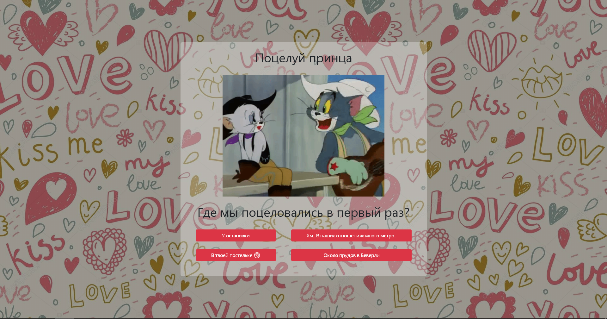

# lovelyhalf
A simple poll site for your half

## Getting Started

### Installing

Step 1. Clone this repo

Step 2. Copy app `lovelyhalf` into your django project

Step 3. Add `lovelyhalf` in `setting.py`:
```
INSTALLED_APPS = [
    ...
    'lovelyhalf'
]
```

Step 4. Add `lovelyhalf` path in your root `urls.py`. Don't forget about media:
```
urlpatterns = [
    ...
    path('lovelyhalf', include('lovelyhalf.urls'))
] + static(settings.MEDIA_URL, document_root=settings.MEDIA_ROOT)
```

## Usage

### Add questions

#### Model
First of all, you should to add some questions for model. Lovelyhalf model has next fields:

| Name field    | Description   |
| ------------- |:-------------:|
| title         | Question's title |
| image         | Image for question      |
| question      | Question's text      |
| answer1       | Answer option 1      |
| answer2       | Answer option 2      |
| answer3       | Answer option 3      |
| answer4       | Answer option 4      |
| correct_answer| Correct answer option      |
| correct_title | Title for bootstrap modal window with the right answer      |
| correct_text  | Text for bootstrap modal window with the right answer      |
| correct_data  | Image of video for bootstrap modal window with the right answer      |

#### Start app

After adding questions just start project
```
python manage.py runserver
```

## License

This project is licensed under the MIT License - see the [LICENSE.md](LICENSE.md) file for details.
